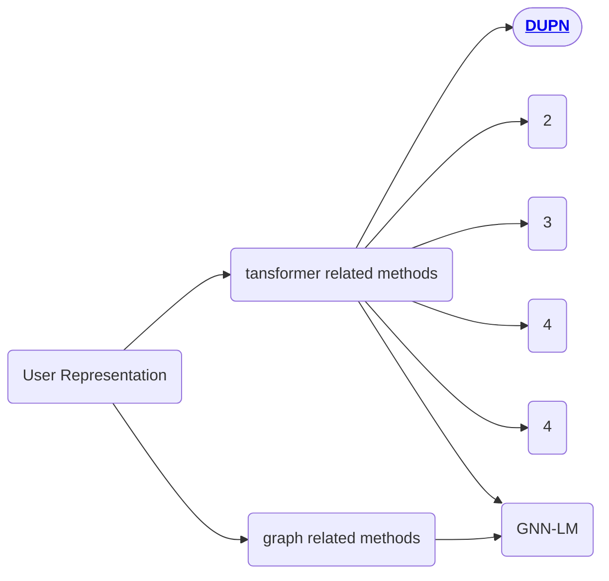
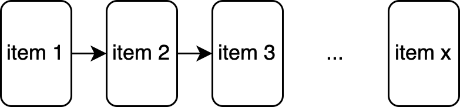
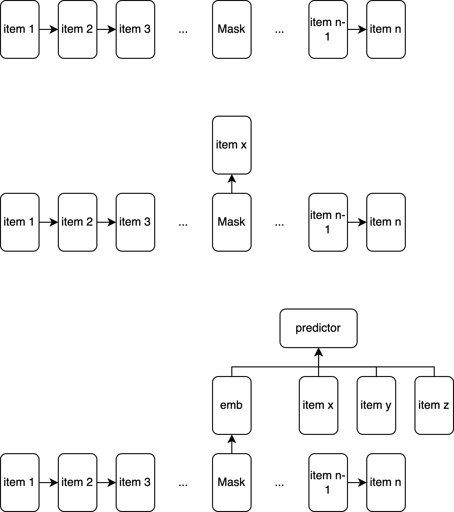
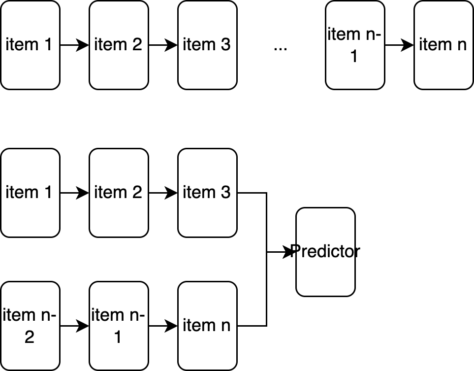

# Pretrained User Representation

sihua.qi@shopee.com

## Datasets

| Dataset               | Address                                                      | Size |
| --------------------- | ------------------------------------------------------------ | ---- |
| Tencent TL dataset    | https://drive.google.com/file/d/1imhHUsivh6oMEtEW-RwVc4OsDqn-xOaP/view |      |
| MovieLens 25M Dataset | https://grouplens.org/datasets/movielens/25m/                | 25m  |
| Amazon                | https://nijianmo.github.io/amazon/index.html                 |      |
| Yelp                  | https://www.yelp.com/dataset                                 |      |
| MIND                  | https://msnews.github.io/                                    |      |
| AliPay                | https://tianchi.aliyun.com/dataset/dataDetail?dataId=53      |      |
| Tmall                 | https://tianchi.aliyun.com/dataset/dataDetail?dataId=42      |      |
| Alimama               | https://tianchi.aliyun.com/dataset/dataDetail?dataId=56      |      |

## User-Representation X-mind

## TimeLine

- 2018 DUPN(DeepUserPreceptionNetwork) (an **emb + lstm** method for user behavior sequence modeling)
- 

## Embedding Method

- Item Feature + Behavior Property: 

  - Item feature: *item_id* / *shop* / *brand* / *category* / *tags*
  - Behavior property: *scenario* / *time* / *type*  

- 

  

## Training Objectives

- **AutoRegressive**(masked multi-head attention):

  

    

  given a list of interactions(items), predict the last interaction(item) $x$ with previous $x-1$ inteactions

  > [PeterRec](./peter_rec.md)

  

- **AutoEncoder**:

  

  

  give a list of interactions(items) with length $n$, randomly mask interaction(item) $1 \le x < n$, predict the masked interaction.

  hidden output may differ with models:

  - Use CLS
  - Use hidden output of masked item
  - Adding Negative Samples 
  - Adding additional info, order time / category / price bucket and etc with more masked prediction objectives

  > [ShopperBert](), [PeterRec]()

- **Contrastive**:

  

    

  given a list of interactions(items), random sample two sub lists from origin list. give preidction for the outputs of two sub lists.
  
  - Use CLS
  - Use hidden output of last item
  - Adding Negative Samples 

    

  
  
     

  given a list of interactions(items), premuatation the list getting a new interaction list, give preidction for the outputs of two  lists.
  
  - Use CLS
  - Use hidden output of last item
  - Adding Negative Samples 
  
  

## Backbones

- TCN
- LSTM
- Transformer
- Aggregated

## Finetuning Methods

## Downstream Tasks

- CTR Prediction
- Learning to Rank
- Price Perference Prediction
- Fashion Icon Following Prediction
- Shop Perference Prediction

## Performance

