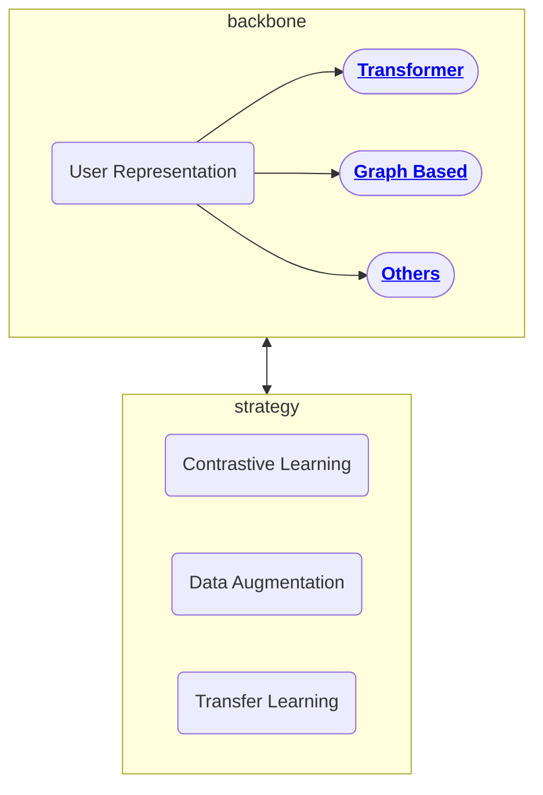

# Pretrained User Representation

sihua.qi@shopee.com

## Roadmaps

## Discussion

#### Difficulties in Work

- lack of training data (usually user tag data are from surveys, we can't send survey to all user, only small portion of user may get this survey, little of them may finish it)
- label noise in the training data

#### Potential Research Area

- Applications:

  - Recommendation
  - User Tagging
  - Topic Mining

- Problem to Solve:

  - data augmentation: with user-item-user relationship graph, help us get more label

  - data denoising
  - graph related: interests(topic) - item linking
  - user-user / user-item graph

## Datasets

| Dataset               | Address                                                      | Size |
| --------------------- | ------------------------------------------------------------ | ---- |
| Tencent TL dataset    | https://drive.google.com/file/d/1imhHUsivh6oMEtEW-RwVc4OsDqn-xOaP/view |      |
| MovieLens 25M Dataset | https://grouplens.org/datasets/movielens/25m/                | 25m  |
| Amazon                | https://nijianmo.github.io/amazon/index.html                 |      |
| Yelp                  | https://www.yelp.com/dataset                                 |      |
| MIND                  | https://msnews.github.io/                                    |      |
| AliPay                | https://tianchi.aliyun.com/dataset/dataDetail?dataId=53      |      |
| Tmall                 | https://tianchi.aliyun.com/dataset/dataDetail?dataId=42      |      |
| Alimama               | https://tianchi.aliyun.com/dataset/dataDetail?dataId=56      |      |

