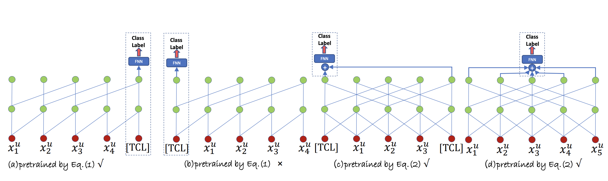
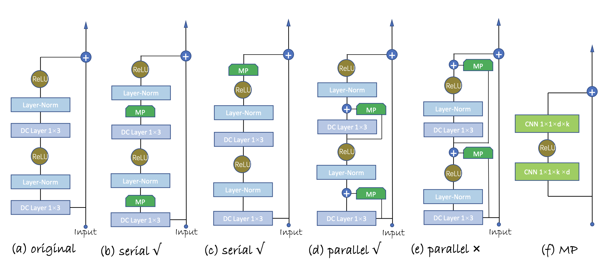

# PeterRec

> Parameter-Efficient Transfer from Sequential Behaviors for User Modeling and Recommendation

## Background

this paper uses  DUPN as baseline, with following improvements:

1. Multi-task learning (DUPN) **vs** One single loss (PeterRec)
2. Addition user/item features (DUPN) **vs** Less features
3. Worse transfer learning (DUPN) **vs** Fine-tuning a small fraction of injected parameters
4. No evidence for better performance with pertaining (CoNet) vs Strong evidence

### General Framework  

- Pre-training Object (NextitNet AutoRegressive):
  $$
  p(x^u;\Theta) = \prod_{i=1}^{n}p(x_i^u|x_1^u,...,x_{i-1}^u;\Theta)
  $$
  where the value of $p(x_i^u|x_1^u,...,x_{i-1}^u;\Theta)$ is the probability of the $i$-th interacted item $x_i^u$ conditioned on all its previous interactions ${x_1^u,...,x_{i-1}^u}$, $\Theta$ is the parameters of pre-trained model including network parameters $\tilde\Theta$​ and the classification layer parameters $\hat \Theta$​.

- Pre-training Object (GRec Masked interaction prediction):
  Let $x_{\triangle}^{u} = \{x_{\triangle_1}^{u},...,x_{\triangle_m}^{u}\}$​​​​​​​​​  $(1 \le m < t)$​​​​​ be the masked interactions, and $\tilde x^u$​​​​ is the sequence of $x^u$​​​​ by replacing items in $x_{\triangle}^u$​​​​ with "—", the probability of $p(x_{\triangle}^u)$​ is given as​​
  $$
  p(x_{\triangle}^u;\Theta)=\prod_{i=1}^mp(x_{\triangle_i}^u|\tilde x^u;\Theta)
  $$
  

  

- Fine-tuning Methods: adding **patch**(**MP**) to origin model

  

