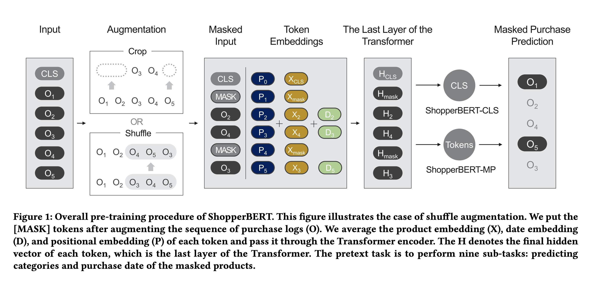
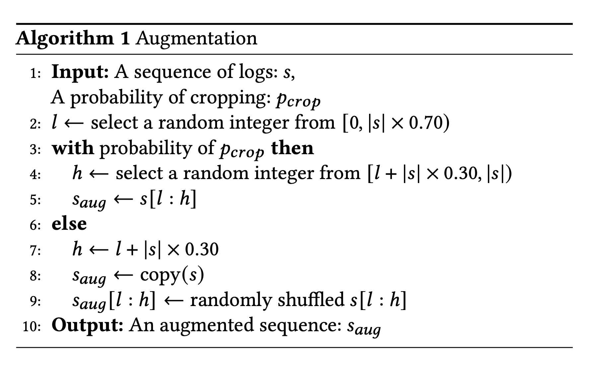

# ShopperBert

> One4all User Representation for Recommender Systems in E-commerce

### General Framework  

- purchase logs: $s=[o_1, o_2, ... , o_n]$​
- product consists of herarchical categories $(c_1, c_2, c_3, c_4)$ and a textual embedding $e$ which is 
  extracted by Sentence-Bert
- use *year*, *month*, *day-of-month*, *day-of-week*, *hour* to represent the date
- product embedding: $x_{prod}=f_{prod}([g(c_1)||g(c_2)||g(c_3)||g(c_4)||f_{text}(e)])$​  where $||$ is the 
  concatenation operation

### Pre-training Methods

- ShopperBERT-MP: mean pooling for last layers' output
- ShopperBERT-CLS: cls of last layer

### Augmentation

- Shuffling: premutation the log sequence
- Cropping: crop logs that are not nearby

### Masked Purchase Prediction

- Category Prediction $(c_1,c_2,c_3,c_4)$
- Time Prediction ($year$, $month$, $day-of-month$, $day-of-week$, $hour$ )

- Loss: avg cross-entropy loss for above 9 tasks

