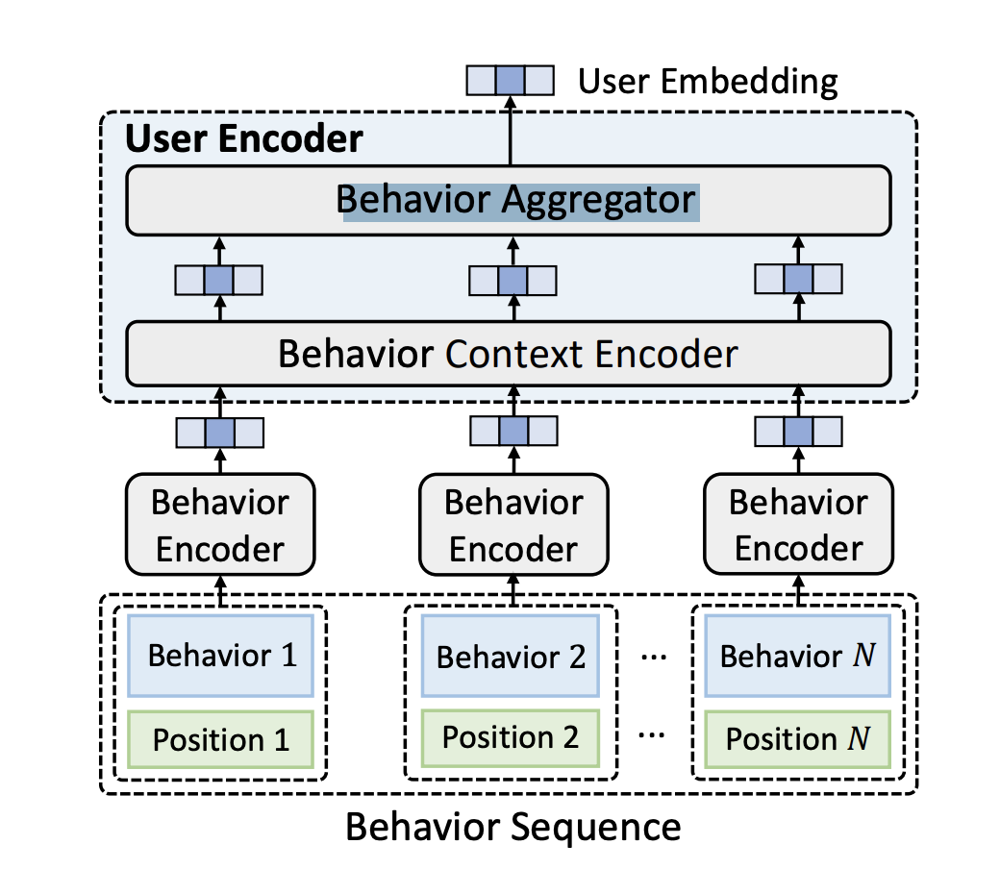
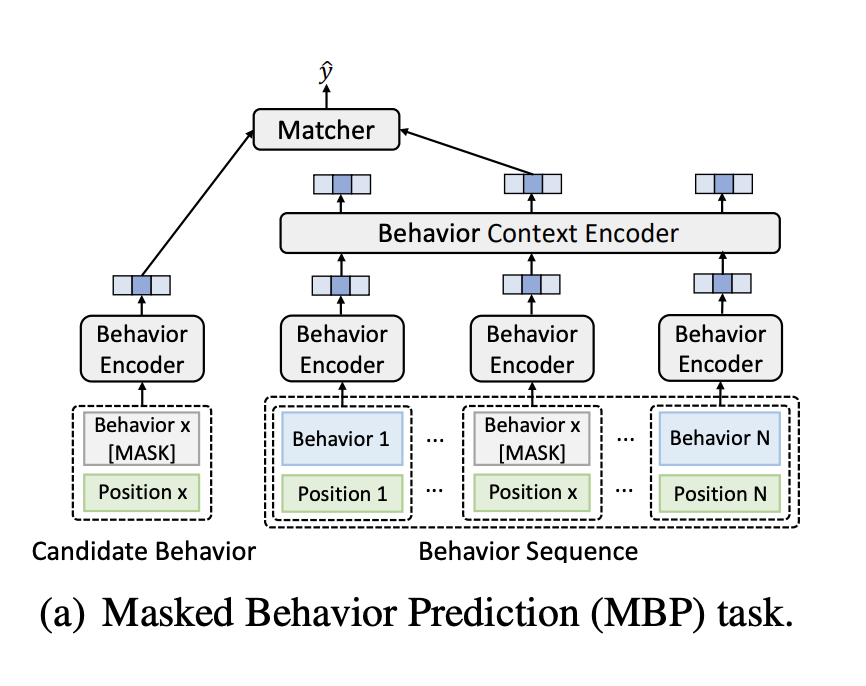
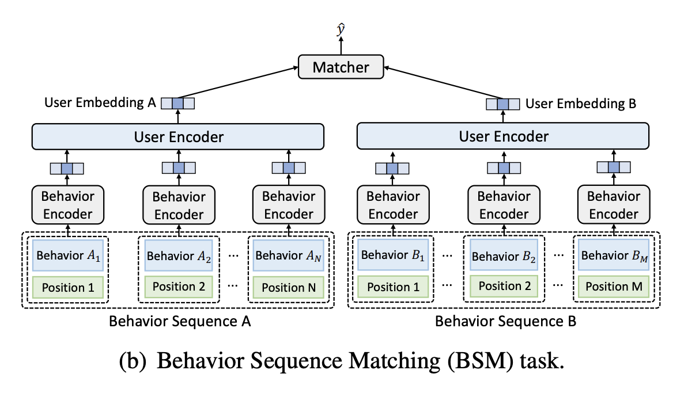

# UserBert
> UserBERT: Contrastive User Model Pre-training  

### General Framework

1. Input: Behavior Sequence (item_id/item_type/item_textual)

2. Input: Behavior Position
3. Behavior Encoder: CNN/DNN/LSTM... (only for behavior type? or item_id ?)

4. Behavior Context Encoder: CNN/DNN/TSFMR... (for item textual info)

5. Behavior Aggregator: max pooling / avg pooling / last pooling

### Tasks

#### Masked Behavior Prediction

- object: whether two behaviors are the same

- sample *K* negative samples 
- use a matcher to jointly predict the matching scores of these *K + 1* candidates based on their relevance
- use cross-entropy as loss function

#### Behavior Sequence Matching

- object: whether two behavior sequences A and B come from the same user

- use the user model to encode both sequences and evaluate their similarity via a matcher

