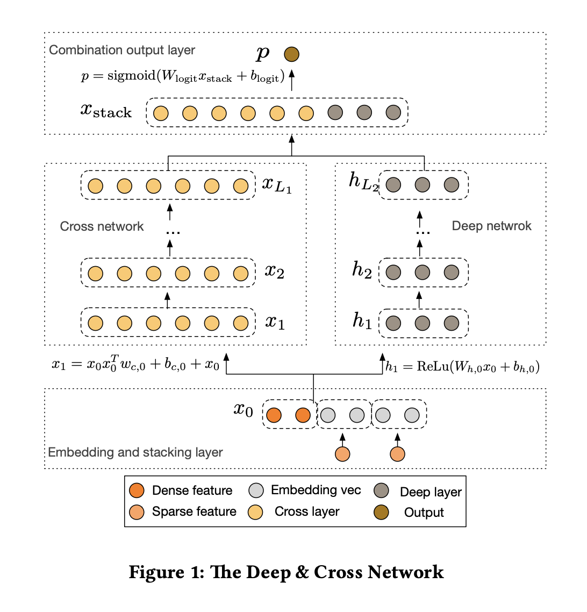

# Deep & Cross Network

> Deep & Cross Network for Ad Click Prediction
>
> DCN V2: Improved Deep & Cross Network and Practical Lessons for Web-scale Learning to Rank Systems
>
> Rank consistent ordinal regression for neural networks with application to age estimation

## DCN

- Deep:

  

- Cross:

  $x_{l+1}=x_{0}x_{l}^{T}w_l+b_l+x_l$

